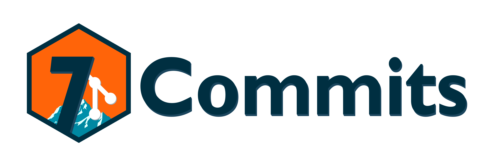

## 📌 Descrizione:
Repository del gruppo 7Commits per il corso di Ingegneria del Software 24/25.

## 👥 Componenti del Gruppo:
- **Marco Cola** - 2079237
- **Ruize Lin** - 2068236
- **Michele Ogniben** - 2042325
- **Stefano Dal Poz** - 1204683
- **Giulia Hu** - 2009118
- **Mattia Piva** - 2008065
- **Giada Rossi** - 2045353

## 🎓 Università e Corso:
- **🏛️ Università di Padova**
- **📚 Corso**: Ingegneria del Software
- **📆 Anno Accademico**: 2024/2025
- **🔢 Gruppo - Lotto**: 20-II

## 📬 Contatti:
- 📧 Email: [7commits@gmail.com](mailto:7commits@gmail.com)
- GitHub: [@7Commits](https://github.com/7Commits)
